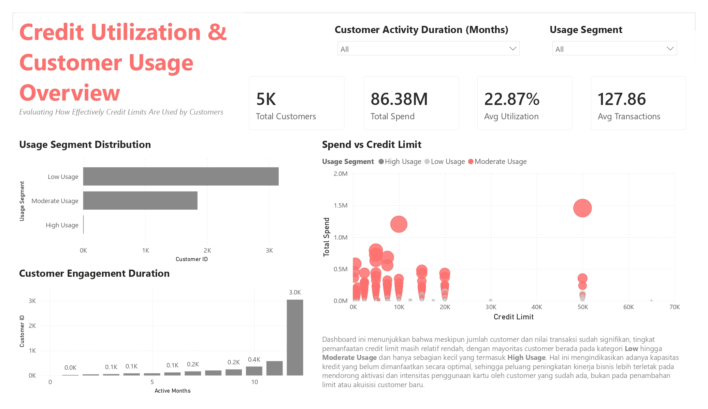

# Credit Utilization & Customer Usage Analysis   



> *Figure 1. Credit Utilization & Customer Usage Dashboard Overview*

---

## Overview  

### Objective  
Support strategic portfolio decision-making by evaluating credit utilization efficiency, identifying structural underutilization patterns, and defining activation strategies to enhance capital productivity and sustainable revenue growth.

---

## Context  

Using portfolio data from **5,000 active customers**, this analysis shifts focus from total spend metrics to **credit utilization efficiency and monetization depth**.  

Although aggregate indicators (86.38M total spend, 127.86 avg transactions) appear strong, average utilization remains at **22.87%**, signaling substantial unused credit capacity.

Power BI dashboards built from structured analytical datasets are used to assess utilization behavior, segment imbalance, and revenue concentration risk.

---

## Tools & Approach  

**Tools:**  
- Power BI  
- Excel (data preparation & transformation)

**Methods & Frameworks:**  
- Exploratory Portfolio Analysis  
- KPI Definition & Utilization Monitoring  
- Segment Classification (Low / Moderate / High Usage)  
- Spend vs Credit Limit Correlation Analysis  
- Revenue Concentration Assessment  
- Capital Productivity Framework  

---

## Key Insights  

- Average credit utilization is **22.87%**, indicating underutilized portfolio capacity.  
- Majority of customers fall into the **Low Usage** segment, creating structural monetization imbalance.  
- Spending does not scale proportionally with assigned credit limits — limit expansion alone will not drive sustainable growth.  
- Long-tenured customers still exhibit low utilization, showing that retention ≠ monetization depth.  
- Revenue dependency risk exists due to concentration within a small High Usage segment.

---

## Decision Strategy  

### Behavioral Activation  
- Utilization-based incentives (threshold-triggered rewards)  
- Targeted migration from Low → Moderate Usage  

### Portfolio Optimization  
- Identify dormant high-limit customers  
- Rebalance exposure based on utilization performance  

### KPI Realignment  
Shift monitoring from:  
Total Spend → Utilization Efficiency & Capital Productivity  

---

## Monitoring & Success Metrics  

- Average Credit Utilization %  
- Segment Distribution Trend  
- Revenue Contribution per Segment  
- Spend-to-Limit Ratio  
- Customer Lifetime Value (future integration)  

KPIs should be monitored periodically to track behavioral uplift and portfolio efficiency improvements.

---

## Key Takeaway  

This analysis demonstrates how credit portfolio data can be translated into a structured monetization strategy.  

Rather than focusing solely on revenue volume or credit expansion, the framework highlights the importance of **capital efficiency, behavioral activation, and portfolio balance**, enabling data-driven and sustainable revenue optimization.
```
